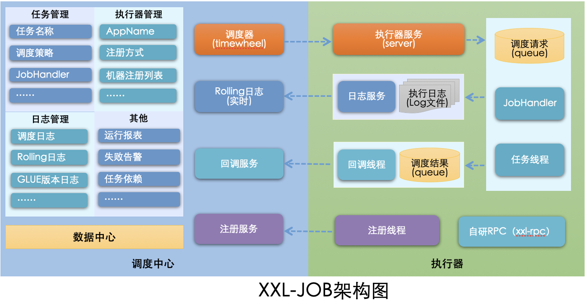
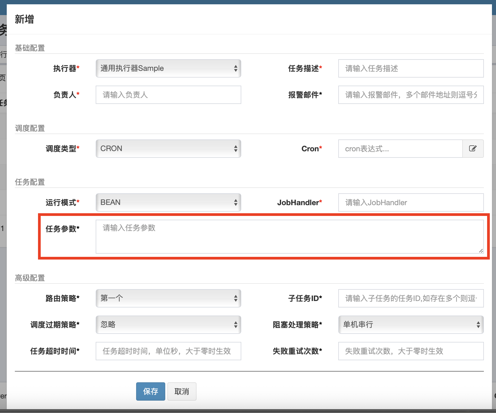
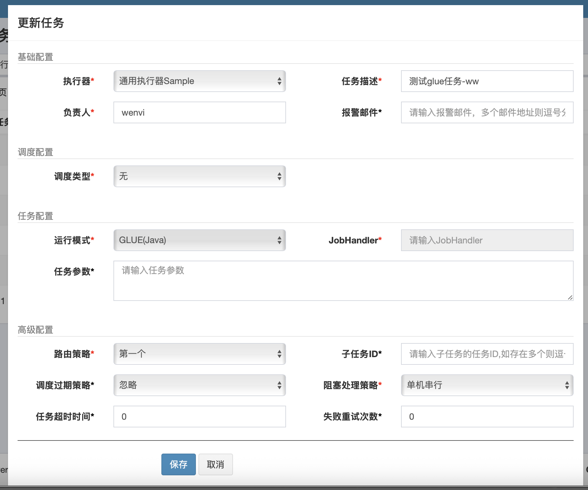
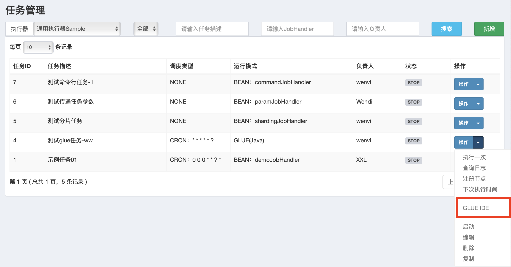
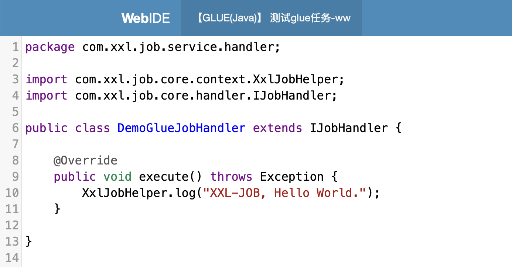

# xxl-job

参考[官方指引](https://www.xuxueli.com/xxl-job/#1.5%20下载)



## 基本概念

### 调度中心（Scheduler Center）

**核心职责**：

1. **任务调度中枢**：通过自研调度引擎（2.1.0版本后移除Quartz依赖，采用时间轮算法）触发任务，支持Cron表达式、固定间隔、API事件等多种触发策略。
2. **集群高可用**：支持多节点部署，通过MySQL悲观锁（`SELECT ... FOR UPDATE`）实现分布式锁，避免集群环境下重复调度。
3. **动态管理**：提供Web界面实时操作任务（启停/修改/终止），配置路由策略（轮询、故障转移、分片广播等），并监控任务进度与日志。
4. **持久化存储**：依赖MySQL管理任务元数据（`xxl_job_info`）、执行日志（`xxl_job_log`）、执行器注册信息（`xxl_job_registry`）等。

**关键设计**：

- 调度与执行解耦：调度中心仅发起HTTP请求，不承担业务逻辑，确保轻量化和扩展性。

### 执行器（Executor）

**核心角色**：

1. **任务执行单元**：集成于业务应用（如Spring Boot项目），通过`@XxlJob`注解定义任务处理器（JobHandler），接收调度中心的HTTP调用并执行业务代码。
2. **集群化部署**：支持动态注册与发现，通过心跳机制（每30秒上报）维护执行器存活状态，调度中心自动感知集群变化。
3. **资源隔离**：多任务使用独立线程池，避免任务雪崩；支持任务超时控制、失败重试及日志实时上报。

**交互流程**：

- 执行器启动后向调度中心注册地址（如`http://192.168.1.10:9999`），调度中心根据路由策略选择目标执行器发起任务请求。

### 任务（Job）

**最小调度单元**：

1. **任务类型**：
   - **Bean模式**：业务代码直接嵌入执行器项目，通过注解声明处理器。
   - **GLUE模式**：脚本任务（Shell/Python等）动态维护在调度中心，支持热更新。
2. **分片机制**：大数据任务可拆分为分片（如`shardIndex/shardTotal`），由不同执行器并行处理，显著提升吞吐量。

## 常见使用方式

### Bean模式

#### 简单任务

```java
@XxlJob("demoJobHandler")
public void demoJobHandler() throws Exception {
  	// 日志打印
    XxlJobHelper.log("XXL-JOB, Hello World.");

    for (int i = 0; i < 5; i++) {
        XxlJobHelper.log("beat at:" + i);
        TimeUnit.SECONDS.sleep(2);
    }
}
```

#### 分片广播

分片广播模式下，调度器会向所有在线的执行器发送执行任务请求：为每个分片确定一个序号（`shardIndex`）、总分片数（`shardTotal`）=在线实例数

> 当某些执行器没有实现要执行的handler时，会导致某些分片失败，因为调度器只根据在线执行器数量分配分片，而不校验执行器是否实现了jobHandler，执行器是否能够执行任务，是在收到请求之后才判断的
>
> 解决办法：
>
> 1. 规范部署。所有在线执行器都实现了需要分片广播的jobHandler
> 2. 执行器分组。在执行器管理下手动新建分组，执行器地址只填入实现了jobHandler的执行器，分片任务时指定该执行器
> 3. 代码特殊处理。jobHandler实现中手动查询实现了jobHandler的实例并为自己计算分片序号，抛弃调度器分配的序号、分片总数

```java
@XxlJob("shardingJobHandler")
public void shardingJobHandler() throws Exception {
    // 分片参数
    int shardIndex = XxlJobHelper.getShardIndex();// 第几个分片
    int shardTotal = XxlJobHelper.getShardTotal();// 总分片数

    XxlJobHelper.log("分片参数：当前分片序号 = {}, 总分片数 = {}", shardIndex, shardTotal);

    // 业务逻辑
    for (int i = 0; i < shardTotal; i++) {
        if (i == shardIndex) {
            XxlJobHelper.log("第 {} 片, 命中分片开始处理", i);
        } else {
            XxlJobHelper.log("第 {} 片, 忽略", i);
        }
    }
}
```

#### 任务带参数

本质上是将任务参数板块中的所有内容作为一个文本传递给执行器



由于是纯文本输入，既可以作为一个String识别，也可以传递json格式字符串给后端解析，自由度较高

```java
@XxlJob(value = "paramJobHandler")
public void parameterizedJobHandler() throws Exception {
    String param = XxlJobHelper.getJobParam();
    XxlJobHelper.log("XXL-JOB, received params: " + param);
}
```

实际上，由于param参数自由度较高，可以传递命令（如`ls- l`）、http链接等，后端通过解析参数获得更强的能力比如命令行执行、http调用等

### GLUE模式

**本质上是通过将代码维护在调度中心的数据库（MySQL的xxl_job_logglue表中），并在执行器端动态加载和执行这些代码**

```sql
mysql> desc xxl_job_logglue;
+-------------+--------------+------+-----+---------+----------------+
| Field       | Type         | Null | Key | Default | Extra          |
+-------------+--------------+------+-----+---------+----------------+
| id          | int          | NO   | PRI | NULL    | auto_increment |
| job_id      | int          | NO   |     | NULL    |                |
| glue_type   | varchar(50)  | YES  |     | NULL    |                |
| glue_source | mediumtext   | YES  |     | NULL    |                |
| glue_remark | varchar(128) | NO   |     | NULL    |                |
| add_time    | datetime     | YES  |     | NULL    |                |
| update_time | datetime     | YES  |     | NULL    |                |
+-------------+--------------+------+-----+---------+----------------+
```

#### java







#### python、shell、...

类似java

## 工作原理

### 调度中心向执行器请求执行任务

1. 执行器会基于Netty启动一个http服务器
2. 只处理http-post请求
3. 根据uri（如 `/beat`,`/idleBeat`）将http请求体反序列化为操作参数对象（如`TriggerParam`、`KillParam`），并调用相应的处理逻辑
   1. `/beat`：直接返回`SUCCESS`状态，用于存活检测
   2. `/idleBeat`：检查任务线程状态，返回执行器是否闲置
   3. `/run`：创建`JobThread`执行任务逻辑，支持GLUE模式动态加载代码
   4. `/kill`：通过`toStop`标志和线程中断双机制终止任务
   5. `/log`：从本地日志文件分页读取任务执行记录

#### `/run`处理逻辑

##### jobHandler模式

1. 查找缓存，如果该jobHandler不存在，则返回jobHandler not found
2. 查找缓存，如果执行该jobHandler的线程不存在或者已过期，则重新创建一个该任务的专属线程
3. 启动执行线程
4. 执行jobHandler的`init`方法
5. 设置本次任务的执行上下文：任务id、任务参数、分片参数
6. 执行任务，调用jobHandler的`execute`方法（如果设置了任务执行超时时间，则会通过`FutureTask`封装任务并执行，然后调用带超时时间的`get`方法获取返回结果）
7. 封装执行结果并返回

##### GLUE模式-java

1. 从源码文本中解析出类实例
2. 类实例必须继承`IJobHandler`类，否则报错
3. 封装成`GlueJobHandler`，然后类似jobHandler模式执行

##### GLUE模式-脚本

1. 封装成`ScriptJobHandler`（继承了`IJobHandler`），然后类似jobHandler模式执行
   1. `execute`方法中基于`java.lang.Runtime#exec`执行脚本

### `@XxlJob`生效逻辑

<del>类维度：`@JobHandler`注解修饰的类需要继承虚拟类`IJobHandler`，实例会注入Spring容器中</del>（新版本已经废弃，不再展开）

方法维度：`@XxlJob`注解修饰的方法，会被封装成`IJobHandler`类实例注入Spring容器中

1. 初始化执行器核心实现类Bean实例（`XxlJobSpringExecutor`）时，会触发`afterSingletonsInstantiated`方法
2. 然后触发`initJobHandlerMethodRepository`方法
3. 遍历Spring容器中的所有Bean，获取Bean上带有`@XxlJob`注解的方法
   1. 从这一步可以看出，所有`@XxlJob`注解的方法，所在的类还必须使用比如`@Component`将类实例交给Spring容器托管，否则无法生效
4. 针对有`@XxlJob`注解的方法，封装为`MethodJobHandler`（处理执行method、init method、destroy method）
5. `MethodJobHandler`的`execute`方法中通过反射的方式invoke指定方法

## 拓展

### 快慢线程池

### 时间轮