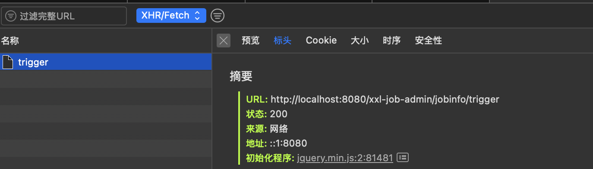

# xxl-job

参考[官方指引](https://www.xuxueli.com/xxl-job/#1.5%20下载)


## 基本概念

### 调度中心（Scheduler Center）

**核心职责**：

1. **任务调度中枢**：通过自研调度引擎（2.1.0版本后移除Quartz依赖，采用时间轮算法）触发任务，支持Cron表达式、固定间隔、API事件等多种触发策略。
2. **集群高可用**：支持多节点部署，通过MySQL悲观锁（`SELECT ... FOR UPDATE`）实现分布式锁，避免集群环境下重复调度。
3. **动态管理**：提供Web界面实时操作任务（启停/修改/终止），配置路由策略（轮询、故障转移、分片广播等），并监控任务进度与日志。
4. **持久化存储**：依赖MySQL管理任务元数据（`xxl_job_info`）、执行日志（`xxl_job_log`）、执行器注册信息（`xxl_job_registry`）等。

**关键设计**：

- 调度与执行解耦：调度中心仅发起HTTP请求，不承担业务逻辑，确保轻量化和扩展性。

### 执行器（Executor）

**核心角色**：

1. **任务执行单元**：集成于业务应用（如Spring Boot项目），通过`@XxlJob`注解定义任务处理器（JobHandler），接收调度中心的HTTP调用并执行业务代码。
2. **集群化部署**：支持动态注册与发现，通过心跳机制（每30秒上报）维护执行器存活状态，调度中心自动感知集群变化。
3. **资源隔离**：多任务使用独立线程池，避免任务雪崩；支持任务超时控制、失败重试及日志实时上报。

**交互流程**：

- 执行器启动后向调度中心注册地址（如`http://192.168.1.10:9999`），调度中心根据路由策略选择目标执行器发起任务请求。

### 任务（Job）

**最小调度单元**：

1. **任务类型**：
   - **Bean模式**：业务代码直接嵌入执行器项目，通过注解声明处理器。
   - **GLUE模式**：脚本任务（Shell/Python等）动态维护在调度中心，支持热更新。
2. **分片机制**：大数据任务可拆分为分片（如`shardIndex/shardTotal`），由不同执行器并行处理，显著提升吞吐量。

## 常见使用方式

### Bean模式

#### 简单任务

```java
@XxlJob("demoJobHandler")
public void demoJobHandler() throws Exception {
  	// 日志打印
    XxlJobHelper.log("XXL-JOB, Hello World.");

    for (int i = 0; i < 5; i++) {
        XxlJobHelper.log("beat at:" + i);
        TimeUnit.SECONDS.sleep(2);
    }
}
```

#### 分片广播

分片广播模式下，调度器会向所有在线的执行器发送执行任务请求：为每个分片确定一个序号（`shardIndex`）、总分片数（`shardTotal`）=在线实例数

> 当某些执行器没有实现要执行的handler时，会导致某些分片失败，因为调度器只根据在线执行器数量分配分片，而不校验执行器是否实现了jobHandler，执行器是否能够执行任务，是在收到请求之后才判断的
>
> 解决办法：
>
> 1. 规范部署。所有在线执行器都实现了需要分片广播的jobHandler
> 2. 执行器分组。在执行器管理下手动新建分组，执行器地址只填入实现了jobHandler的执行器，分片任务时指定该执行器
> 3. 代码特殊处理。jobHandler实现中手动查询实现了jobHandler的实例并为自己计算分片序号，抛弃调度器分配的序号、分片总数

```java
@XxlJob("shardingJobHandler")
public void shardingJobHandler() throws Exception {
    // 分片参数
    int shardIndex = XxlJobHelper.getShardIndex();// 第几个分片
    int shardTotal = XxlJobHelper.getShardTotal();// 总分片数

    XxlJobHelper.log("分片参数：当前分片序号 = {}, 总分片数 = {}", shardIndex, shardTotal);

    // 业务逻辑
    for (int i = 0; i < shardTotal; i++) {
        if (i == shardIndex) {
            XxlJobHelper.log("第 {} 片, 命中分片开始处理", i);
        } else {
            XxlJobHelper.log("第 {} 片, 忽略", i);
        }
    }
}
```

#### 任务带参数

本质上是将任务参数板块中的所有内容作为一个文本传递给执行器


由于是纯文本输入，既可以作为一个String识别，也可以传递json格式字符串给后端解析，自由度较高

```java
@XxlJob(value = "paramJobHandler")
public void parameterizedJobHandler() throws Exception {
    String param = XxlJobHelper.getJobParam();
    XxlJobHelper.log("XXL-JOB, received params: " + param);
}
```

实际上，由于param参数自由度较高，可以传递命令（如`ls- l`）、http链接等，后端通过解析参数获得更强的能力比如命令行执行、http调用等

### GLUE模式

**本质上是通过将代码维护在调度中心的数据库（MySQL的xxl_job_logglue表中），并在执行器端动态加载和执行这些代码**

```sql
mysql> desc xxl_job_logglue;
+-------------+--------------+------+-----+---------+----------------+
| Field       | Type         | Null | Key | Default | Extra          |
+-------------+--------------+------+-----+---------+----------------+
| id          | int          | NO   | PRI | NULL    | auto_increment |
| job_id      | int          | NO   |     | NULL    |                |
| glue_type   | varchar(50)  | YES  |     | NULL    |                |
| glue_source | mediumtext   | YES  |     | NULL    |                |
| glue_remark | varchar(128) | NO   |     | NULL    |                |
| add_time    | datetime     | YES  |     | NULL    |                |
| update_time | datetime     | YES  |     | NULL    |                |
+-------------+--------------+------+-----+---------+----------------+
```

#### java


#### python、shell、...

类似java

## 工作原理

### 调度中心向执行器请求执行任务

1. 执行器会基于Netty启动一个http服务器
2. 只处理http-post请求
3. 根据uri（如 `/beat`,`/idleBeat`）将http请求体反序列化为操作参数对象（如`TriggerParam`、`KillParam`），并调用相应的处理逻辑
   1. `/beat`：直接返回`SUCCESS`状态，用于存活检测
   2. `/idleBeat`：检查任务线程状态，返回执行器是否闲置
   3. `/run`：创建`JobThread`执行任务逻辑，支持GLUE模式动态加载代码
   4. `/kill`：通过`toStop`标志和线程中断双机制终止任务
   5. `/log`：从本地日志文件分页读取任务执行记录

#### `/run`处理逻辑

##### jobHandler模式

1. 查找缓存，如果该jobHandler不存在，则返回jobHandler not found
2. 查找缓存，如果执行该jobHandler的线程不存在或者已过期，则重新创建一个该任务的专属线程
3. 启动执行线程
4. 执行jobHandler的`init`方法
5. 设置本次任务的执行上下文：任务id、任务参数、分片参数
6. 执行任务，调用jobHandler的`execute`方法（如果设置了任务执行超时时间，则会通过`FutureTask`封装任务并执行，然后调用带超时时间的`get`方法获取返回结果）
7. 封装执行结果并返回

##### GLUE模式-java

1. 从源码文本中解析出类实例
2. 类实例必须继承`IJobHandler`类，否则报错
3. 封装成`GlueJobHandler`，然后类似jobHandler模式执行

##### GLUE模式-脚本

1. 封装成`ScriptJobHandler`（继承了`IJobHandler`），然后类似jobHandler模式执行
   1. `execute`方法中基于`java.lang.Runtime#exec`执行脚本

### `@XxlJob`生效逻辑

<del>类维度：`@JobHandler`注解修饰的类需要继承虚拟类`IJobHandler`，实例会注入Spring容器中</del>（新版本已经废弃，不再展开）

方法维度：`@XxlJob`注解修饰的方法，会被封装成`IJobHandler`类实例注入Spring容器中

1. 初始化执行器核心实现类Bean实例（`XxlJobSpringExecutor`）时，会触发`afterSingletonsInstantiated`方法
2. 然后触发`initJobHandlerMethodRepository`方法
3. 遍历Spring容器中的所有Bean，获取Bean上带有`@XxlJob`注解的方法
   1. 从这一步可以看出，所有`@XxlJob`注解的方法，所在的类还必须使用比如`@Component`将类实例交给Spring容器托管，否则无法生效
4. 针对有`@XxlJob`注解的方法，封装为`MethodJobHandler`（处理执行method、init method、destroy method）
5. `MethodJobHandler`的`execute`方法中通过反射的方式invoke指定方法

## 拓展

### 快慢线程池

XXL-JOB 在调度中心触发任务时，会通过**快慢线程池机制**将任务提交到线程池中异步处理，而非直接同步调用执行器。这一设计是调度中心高并发、高性能调度的核心机制

- **快线程池（fastTriggerPool）**

  默认优先将任务提交至快线程池，适用于**短时任务**（耗时 ≤500ms）。例如高频的简单统计任务或状态检查任务，通过快速处理避免调度积压

- **慢线程池（slowTriggerPool）**

  若任务被标记为“慢任务”（同一任务1分钟内超时次数≥10次），则降级到慢线程池处理。例如耗时较长的数据导出或复杂计算任务，通过资源隔离避免影响其他任务

#### 从`/trigger`开始

前端调用“执行”时，会请求`/trigger`



实际上会调用`com.xxl.job.admin.core.thread.JobTriggerPoolHelper#addTrigger`将任务添加到线程池中处理

```java
// com.xxl.job.admin.core.thread.JobTriggerPoolHelper#addTrigger
public void addTrigger(final int jobId,
                           final TriggerTypeEnum triggerType,
                           final int failRetryCount,
                           final String executorShardingParam,
                           final String executorParam,
                           final String addressList) {

    // 默认使用快线程池
    ThreadPoolExecutor triggerPool_ = fastTriggerPool;
    AtomicInteger jobTimeoutCount = jobTimeoutCountMap.get(jobId);
  	// 维护原子计数器，当1分钟内有10次触发任务的时间过长（注意，非执行任务的时间，而是调度中心请求所有相关执行器成功的时间），则后续该任务由慢线程池处理
    if (jobTimeoutCount!=null && jobTimeoutCount.get() > 10) {      // job-timeout 10 times in 1 min
        triggerPool_ = slowTriggerPool;
    }

    // trigger
    triggerPool_.execute(new Runnable() {
        @Override
        public void run() {

            long start = System.currentTimeMillis();

            try {
                // do trigger
                XxlJobTrigger.trigger(jobId, triggerType, failRetryCount, executorShardingParam, executorParam, addressList);
            } catch (Throwable e) {
                logger.error(e.getMessage(), e);
            } finally {

                // 这里使用简单的固定窗口机制维护计数器，维护一个1分钟的时间窗口
                long minTim_now = System.currentTimeMillis()/60000;
                if (minTim != minTim_now) {
                    minTim = minTim_now;
                    jobTimeoutCountMap.clear();
                }

                // 任务调度超过500ms就认为本次触发任务太慢
                long cost = System.currentTimeMillis()-start;
                if (cost > 500) {       // ob-timeout threshold 500ms
                    AtomicInteger timeoutCount = jobTimeoutCountMap.putIfAbsent(jobId, new AtomicInteger(1));
                    if (timeoutCount != null) {
                        timeoutCount.incrementAndGet();
                    }
                }
            }
        }
        @Override
        public String toString() {
            return "Job Runnable, jobId:"+jobId;
        }
    });
}
```

#### 调度核心代码

```java
// com.xxl.job.admin.core.trigger.XxlJobTrigger#trigger
public static void trigger(int jobId,
                               TriggerTypeEnum triggerType,
                               int failRetryCount,
                               String executorShardingParam,
                               String executorParam,
                               String addressList) {

    // 从xxl_job_info表获取任务信息
    XxlJobInfo jobInfo = XxlJobAdminConfig.getAdminConfig().getXxlJobInfoDao().loadById(jobId);
    if (jobInfo == null) {
        logger.warn(">>>>>>>>>>>> trigger fail, jobId invalid，jobId={}", jobId);
        return;
    }
    if (executorParam != null) {
        jobInfo.setExecutorParam(executorParam);
    }
    int finalFailRetryCount = failRetryCount>=0?failRetryCount:jobInfo.getExecutorFailRetryCount();
    XxlJobGroup group = XxlJobAdminConfig.getAdminConfig().getXxlJobGroupDao().load(jobInfo.getJobGroup());

    // 使用用户输入的执行地址列表覆盖自动注册的执行器组地址列表（如有），在getRegistryList方法中有体现
    if (addressList!=null && addressList.trim().length()>0) {
        group.setAddressType(1);
        group.setAddressList(addressList.trim());
    }

    // sharding param
    int[] shardingParam = null;
    if (executorShardingParam!=null){
        String[] shardingArr = executorShardingParam.split("/");
        if (shardingArr.length==2 && isNumeric(shardingArr[0]) && isNumeric(shardingArr[1])) {
            shardingParam = new int[2];
            shardingParam[0] = Integer.valueOf(shardingArr[0]);
            shardingParam[1] = Integer.valueOf(shardingArr[1]);
        }
    }
    if (ExecutorRouteStrategyEnum.SHARDING_BROADCAST==ExecutorRouteStrategyEnum.match(jobInfo.getExecutorRouteStrategy(), null)
            && group.getRegistryList()!=null && !group.getRegistryList().isEmpty()
            && shardingParam==null) {
      	// 遍历执行器组内所有执行器，发起分片请求，分片索引即为遍历序号，分片总数则是执行器数
      	// 这里可以看出，实际上分片广播模式下，并不会考虑用户提供的机器地址列表，而是实实在在的广播
        for (int i = 0; i < group.getRegistryList().size(); i++) {
            processTrigger(group, jobInfo, finalFailRetryCount, triggerType, i, group.getRegistryList().size());
        }
    } else {
      	// 非分片下，本质上就是固定分片索引0，分片总数1
        if (shardingParam == null) {
            shardingParam = new int[]{0, 1};
        }
        processTrigger(group, jobInfo, finalFailRetryCount, triggerType, shardingParam[0], shardingParam[1]);
    }

}
```

```java
// com.xxl.job.admin.core.trigger.XxlJobTrigger#processTrigger
private static void processTrigger(XxlJobGroup group, XxlJobInfo jobInfo, int finalFailRetryCount, TriggerTypeEnum triggerType, int index, int total){

    // 设置任务参数、路由策略（分片广播也算）
  	...

    // 根据路由策略计算执行器地址
    String address = null;
    ReturnT<String> routeAddressResult = null;
    if (group.getRegistryList()!=null && !group.getRegistryList().isEmpty()) {
        if (ExecutorRouteStrategyEnum.SHARDING_BROADCAST == executorRouteStrategyEnum) {
            if (index < group.getRegistryList().size()) {
                address = group.getRegistryList().get(index);
            } else {
                address = group.getRegistryList().get(0);
            }
        } else {
            routeAddressResult = executorRouteStrategyEnum.getRouter().route(triggerParam, group.getRegistryList());
            if (routeAddressResult.getCode() == ReturnT.SUCCESS_CODE) {
                address = routeAddressResult.getContent();
            }
        }
    } else {
        routeAddressResult = new ReturnT<String>(ReturnT.FAIL_CODE, I18nUtil.getString("jobconf_trigger_address_empty"));
    }

    // 请求本次要调度的执行器
    ReturnT<String> triggerResult = null;
    if (address != null) {
        triggerResult = runExecutor(triggerParam, address);
    } else {
        triggerResult = new ReturnT<String>(ReturnT.FAIL_CODE, null);
    }

  	// 记录日志
    ...
}
```

#### 发送post请求

通过工具类`com.xxl.job.core.util.XxlJobRemotingUtil#postBody`发送post请求给执行器，至此调度完毕

### 时间轮

XXL-JOB 中的时间轮算法是一种高效管理定时任务的调度机制，其核心思想是通过环形结构和指针转动实现任务的批量触发。时间轮维护一定的时间间隙（xxl-job是60个槽位，对应一分钟内的每一秒），在每个间隙中，维护该秒要执行的任务。

>  与传统的时间轮不同的是，xxl-job每次只预取5s内的任务放到轮中，因此不会存在需要遍历多轮后再执行的任务；而传统时间轮则是，任务会维护一个剩余遍历轮数，直到为0，表示应当立即执行，否则轮数-1等待下一轮遍历

这里我将时间轮算法看作是**遍历时间**，而一些基于优先队列的取任务算法，我看作是**遍历任务**

时间轮在定时取要触发的任务时使用，`JobScheduleHelper`类是定时取任务的核心类

源码较长，下面会删减不重要的代码块，但不会改变代码的结构

```java
// com.xxl.job.admin.core.thread.JobScheduleHelper#start
public void start(){

    // schedule thread
    scheduleThread = new Thread(new Runnable() {
        @Override
        public void run() {

            try {
              	// 对齐时间，按照秒级间隔执行
                TimeUnit.MILLISECONDS.sleep(5000 - System.currentTimeMillis()%1000 );
            } catch (Throwable e) {
                if (!scheduleThreadToStop) {
                    logger.error(e.getMessage(), e);
                }
            }

            while (!scheduleThreadToStop) {

                // Scan Job
                long start = System.currentTimeMillis();

                Connection conn = null;
                Boolean connAutoCommit = null;
                PreparedStatement preparedStatement = null;

                boolean preReadSuc = true;
                try {

                    conn = XxlJobAdminConfig.getAdminConfig().getDataSource().getConnection();
                    connAutoCommit = conn.getAutoCommit();
                    conn.setAutoCommit(false);
										
                  	// 获取数据库锁，主要是在调度中心集群部署模式下，避免并发问题
                    preparedStatement = conn.prepareStatement(  "select * from xxl_job_lock where lock_name = 'schedule_lock' for update" );
                    preparedStatement.execute();
                    // tx start

                    // 1、pre read
                    long nowTime = System.currentTimeMillis();
                  	// 提前取5s内会到期的任务，这是常见的操作，避免到点再取任务触发延迟高
                  	// scheduleJobQuery的sql就是简单的判断所有任务的trigger_next_time是否在设定时间之前
                  	// 这里xxl_job有一个小优化，时间字段存储的是时间戳，而非可读的标准时间格式，提高比较速度
                    List<XxlJobInfo> scheduleList = XxlJobAdminConfig.getAdminConfig().getXxlJobInfoDao().scheduleJobQuery(nowTime + PRE_READ_MS, preReadCount);
                    if (scheduleList!=null && scheduleList.size()>0) {
                        // 2、push time-ring
                        for (XxlJobInfo jobInfo: scheduleList) {

                            // time-ring jump
                            if (nowTime > jobInfo.getTriggerNextTime() + PRE_READ_MS) {
                                // 任务触发时间已经错过了5s了，根据调度过期策略决定是否触发
																...
                                // 计算下一次触发时间
                                refreshNextValidTime(jobInfo, new Date());

                            } else if (nowTime > jobInfo.getTriggerNextTime()) {
                                // 任务触发时间到了，并且不超过5s，直接执行
                              	...
                                // 计算下一次触发时间
                                refreshNextValidTime(jobInfo, new Date());

                                // 如果该任务下一次触发时间在5s内，那么直接将其放入时间轮，避免高频任务的触发延迟高
                                if (jobInfo.getTriggerStatus()==1 && nowTime + PRE_READ_MS > jobInfo.getTriggerNextTime()) {
                                    // 计算下一次任务触发所在的秒
                                    int ringSecond = (int)((jobInfo.getTriggerNextTime()/1000)%60);
                                    // 放到时间轮
                                    pushTimeRing(ringSecond, jobInfo.getId());
                                    // 计算下下次触发时间
                                    refreshNextValidTime(jobInfo, new Date(jobInfo.getTriggerNextTime()));
                                }
                            } else {
                                // 触发时间还没到，放入时间轮

                                // 计算下一次任务触发所在的秒
                                int ringSecond = (int)((jobInfo.getTriggerNextTime()/1000)%60);
                                // 放到时间轮
                                pushTimeRing(ringSecond, jobInfo.getId());
                                // 计算下次触发时间
                                refreshNextValidTime(jobInfo, new Date(jobInfo.getTriggerNextTime()));
                            }

                        }

                        // 更新数据库任务表
                        for (XxlJobInfo jobInfo: scheduleList) {
                            XxlJobAdminConfig.getAdminConfig().getXxlJobInfoDao().scheduleUpdate(jobInfo);
                        }

                    } else {
                        preReadSuc = false;
                    }

                    // tx stop


                } catch (Throwable e) {
                    if (!scheduleThreadToStop) {
                        logger.error(">>>>>>>>>>> xxl-job, JobScheduleHelper#scheduleThread error:{}", e);
                    }
                } finally {
										// 关闭数据库连接等
                  	...
                }
              
								// 对齐时间，按照秒级间隔执行
              	...

            }

            logger.info(">>>>>>>>>>> xxl-job, JobScheduleHelper#scheduleThread stop");
        }
    });
    scheduleThread.setDaemon(true);
    scheduleThread.setName("xxl-job, admin JobScheduleHelper#scheduleThread");
    scheduleThread.start();


    // 时间轮任务处理线程
    ringThread = new Thread(new Runnable() {
        @Override
        public void run() {

            while (!ringThreadToStop) {

                // 对齐时间
								...

                try {
                    List<Integer> ringItemData = new ArrayList<>();
                    int nowSecond = Calendar.getInstance().get(Calendar.SECOND);   // 避免处理耗时太长，跨过刻度，向前校验一个刻度，也就是取当前秒和上一秒的任务
                    for (int i = 0; i < 2; i++) {
                        List<Integer> tmpData = ringData.remove( (nowSecond+60-i)%60 );
                        if (tmpData != null) {
                            ringItemData.addAll(tmpData);
                        }
                    }

                    // 执行轮内任务
                    logger.debug(">>>>>>>>>>> xxl-job, time-ring beat : " + nowSecond + " = " + Arrays.asList(ringItemData) );
                    if (ringItemData.size() > 0) {
                        // do trigger
                        for (int jobId: ringItemData) {
                            // do trigger
                            JobTriggerPoolHelper.trigger(jobId, TriggerTypeEnum.CRON, -1, null, null, null);
                        }
                        // clear
                        ringItemData.clear();
                    }
                } catch (Throwable e) {
                    if (!ringThreadToStop) {
                        logger.error(">>>>>>>>>>> xxl-job, JobScheduleHelper#ringThread error:{}", e);
                    }
                }
            }
            logger.info(">>>>>>>>>>> xxl-job, JobScheduleHelper#ringThread stop");
        }
    });
    ringThread.setDaemon(true);
    ringThread.setName("xxl-job, admin JobScheduleHelper#ringThread");
    ringThread.start();
}
```

