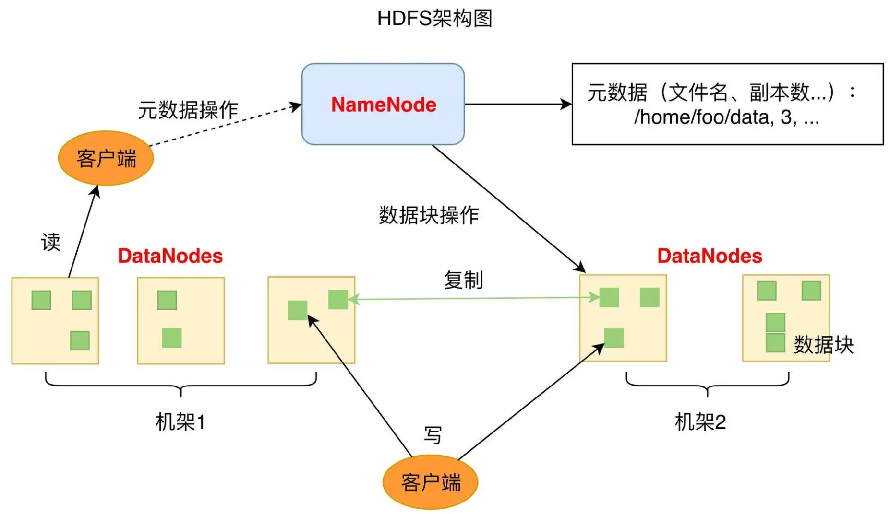
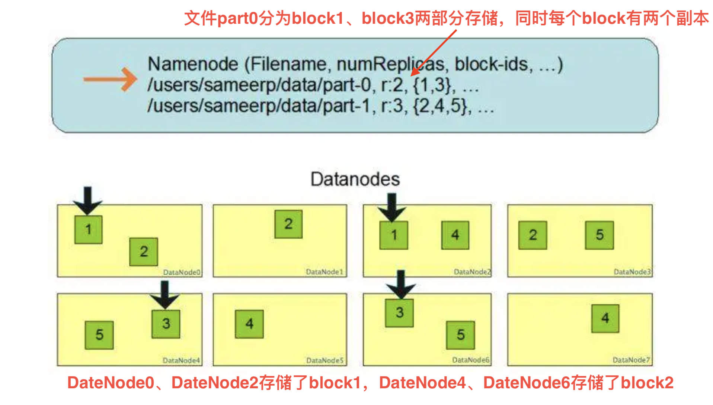
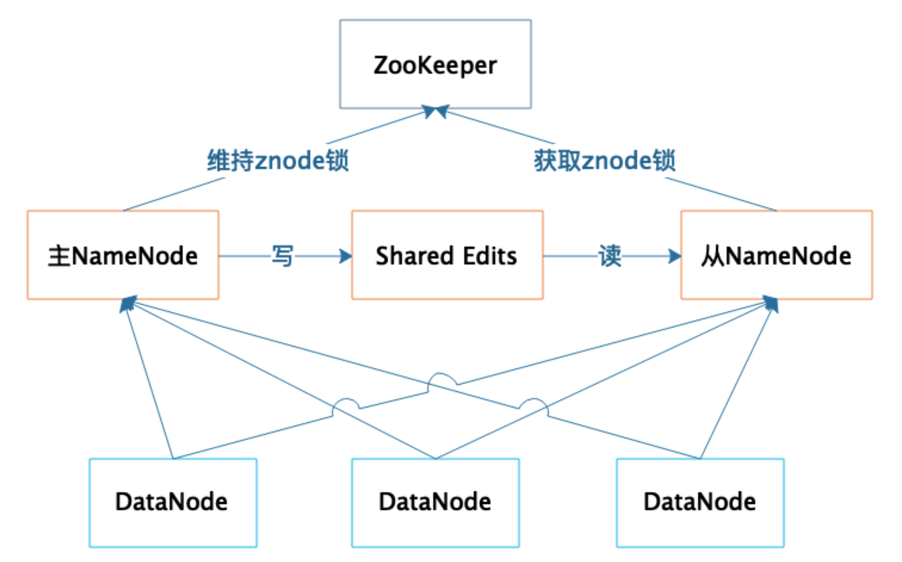
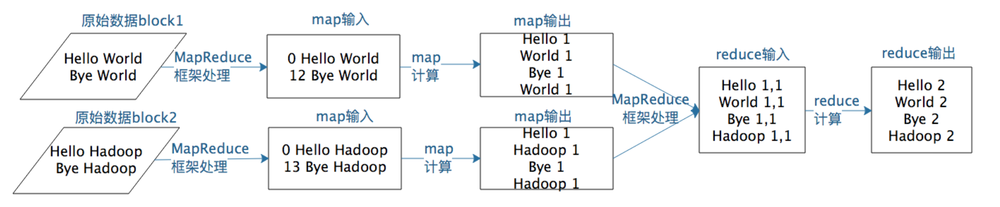

# 从0开始学大数据

>  参考极客时间《从0开始学大数据》

## HDFS

HDFS（Hadoop Distributed File System）是Apache Hadoop生态系统的核心组件之一，是一个专为大规模数据存储和处理设计的**分布式文件系统**

和RAID设计原理类似，HDFS基于大规模的分布式服务器集群，对数据分片后进行并行读写及冗余存储，整个HDFS的存储空间达到PB级容量

> RAID（Redundant Array of Independent Disks，独立冗余磁盘阵列）是一种通过将多个物理磁盘组合成逻辑单元的数据存储技术，旨在提升性能、数据可靠性或两者兼顾

### HDFS架构



- DataNode：负责文件的存储和读写。HDFS将文件分为多个数据块，每个DataNode服务器可以存储一部份
- NameNode：负责HDFS集群元数据管理，包括文件路径、数据块id、存储位置等
  - 有点类似RocketMQ中的NameServer，在客户端和实际存储中加一层代理



### 高可用设计

1. **数据存储故障**：存储数据错乱

   1. 通过计算校验和判断是否出错

2. **磁盘故障**：物理损坏

   1. DataNode服务器会上报磁盘上存储的所有block_id给NameNode
   2. NameNode检查这些block_id的备份所在DataNode，并使其复制到其他DataNode以保证可靠性（副本数满足设定）

3. **DataNode故障**

   1. NameNode长时间未收到DataNode心跳，则认为其宕机
   2. NameNode会查找该DataNode上存储的所有block_id，然后通知其备份所在DataNode复制到其他DataNode

   > 这里和Kafka消费者向协调者上报心跳超时一样，会触发消费者组重平衡

4. **NameNode故障**

   1. 基于主从方式提供高可用
   2. 主从角色取决于zookeeper上znode的抢占情况（类似kafka控制器选举）
   3. 主从NameNode之间通过共享存储系统同步信息（主节点写入、从节点读出）
   4. DataNode会向主从NameNode都发送心跳，但只有主节点会响应
   5. 

## MapReduce

MapReduce是一种用于大规模数据处理的**分布式编程模型**，最初由Google提出，后成为Hadoop生态系统的核心组件。其核心思想是通过“分而治之”的方式，将复杂任务分解为可并行处理的Map和Reduce两个阶段，简化分布式计算的开发难度

### 作为编程模型

> 这里可以参考java的stream api中的`map`方法（操作元素）、`reduce`方法（聚合元素）

包含Map和Reduce两个过程

- Map：将输入数据分割为独立的数据块，由多个Map任务并行处理，生成中间键值对
  - 输入是一对 <Key, Value> 值，经过 map 计算后输出一对 <Key, Value> 值
  - 然后将相同 Key 合并，形成<Key, Value 集合 >
  - List \< k : v \> 变成 \< k : List\<v\> \>
- Reduce：对Map输出的中间结果按键分组、排序后，由Reduce任务聚合处理（如求和、计数），生成最终结果
  - \< k : List\<v\> \> 变成 v或者\< k : List\<v\> \>

#### 例子：统计词频

```java
public class WordCount {
  public static class TokenizerMapper extends Mapper<Object, Text, Text, IntWritable>{
    private final static IntWritable one = new IntWritable(1);
    private Text word = new Text();
    public void map(Object key, Text value, Context context) throws IOException, InterruptedException {
      StringTokenizer itr = new StringTokenizer(value.toString());
      // 拆开词，作为独立的统计个体
      while (itr.hasMoreTokens()) {
        word.set(itr.nextToken());
        context.write(word, one);
  		}
		}
	}
  public static class IntSumReducer extends Reducer<Text,IntWritable,Text,IntWritable> {
    private IntWritable result = new IntWritable();
    public void reduce(Text key, Iterable<IntWritable> values, Context context) throws IOException, InterruptedException {
      int sum = 0;
      // 基于词聚合所有统计个体
      for (IntWritable val : values) {
        sum += val.get();
      }
      result.set(sum);
      context.write(key, result);
    }
  }
}
```



### 作为计算框架

