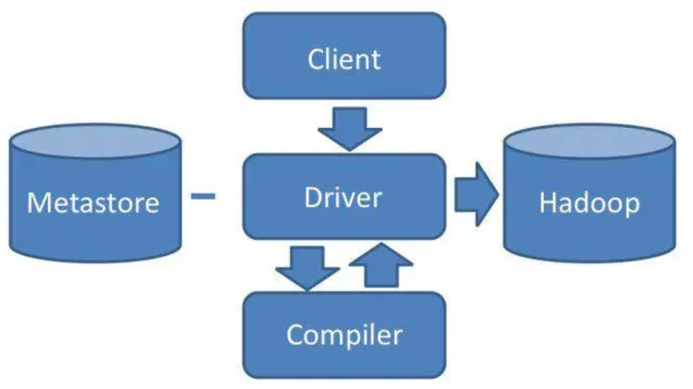

# 从0开始学大数据

>  参考极客时间《从0开始学大数据》

## HDFS

HDFS（Hadoop Distributed File System）是Apache Hadoop生态系统的核心组件之一，是一个专为大规模数据存储和处理设计的**分布式文件系统**

和RAID设计原理类似，HDFS基于大规模的分布式服务器集群，对数据分片后进行并行读写及冗余存储，整个HDFS的存储空间达到PB级容量

> RAID（Redundant Array of Independent Disks，独立冗余磁盘阵列）是一种通过将多个物理磁盘组合成逻辑单元的数据存储技术，旨在提升性能、数据可靠性或两者兼顾

### HDFS架构


- DataNode：负责文件的存储和读写。HDFS将文件分为多个数据块，每个DataNode服务器可以存储一部份
- NameNode：负责HDFS集群元数据管理，包括文件路径、数据块id、存储位置等
  - 有点类似RocketMQ中的NameServer，在客户端和实际存储中加一层代理


### 高可用设计

1. **数据存储故障**：存储数据错乱

   1. 通过计算校验和判断是否出错

2. **磁盘故障**：物理损坏

   1. DataNode服务器会上报磁盘上存储的所有block_id给NameNode
   2. NameNode检查这些block_id的备份所在DataNode，并使其复制到其他DataNode以保证可靠性（副本数满足设定）

3. **DataNode故障**

   1. NameNode长时间未收到DataNode心跳，则认为其宕机
   2. NameNode会查找该DataNode上存储的所有block_id，然后通知其备份所在DataNode复制到其他DataNode

   > 这里和Kafka消费者向协调者上报心跳超时一样，会触发消费者组重平衡

4. **NameNode故障**

   1. 基于主从方式提供高可用
   2. 主从角色取决于zookeeper上znode的抢占情况（类似kafka控制器选举）
   3. 主从NameNode之间通过共享存储系统同步信息（主节点写入、从节点读出）
   4. DataNode会向主从NameNode都发送心跳，但只有主节点会响应
   5. 

## MapReduce

MapReduce是一种用于大规模数据处理的**分布式编程模型**，最初由Google提出，后成为Hadoop生态系统的核心组件。其核心思想是通过“分而治之”的方式，将复杂任务分解为可并行处理的Map和Reduce两个阶段，简化分布式计算的开发难度

### 作为编程模型

> 这里可以参考java的stream api中的`map`方法（操作元素）、`reduce`方法（聚合元素）

包含Map和Reduce两个过程

- Map：将输入数据分割为独立的数据块，由多个Map任务并行处理，生成中间键值对
  - 输入是一对 <Key, Value> 值，经过 map 计算后输出一对 <Key, Value> 值
  - 然后将相同 Key 合并，形成<Key, Value 集合 >
  - List \< k : v \> 变成 \< k : List\<v\> \>
- Reduce：对Map输出的中间结果按键分组、排序后，由Reduce任务聚合处理（如求和、计数），生成最终结果
  - \< k : List\<v\> \> 变成 v或者\< k : List\<v\> \>

#### 例子：统计词频

```java
public class WordCount {
  public static class TokenizerMapper extends Mapper<Object, Text, Text, IntWritable>{
    private final static IntWritable one = new IntWritable(1);
    private Text word = new Text();
    public void map(Object key, Text value, Context context) throws IOException, InterruptedException {
      StringTokenizer itr = new StringTokenizer(value.toString());
      // 拆开词，作为独立的统计个体
      while (itr.hasMoreTokens()) {
        word.set(itr.nextToken());
        context.write(word, one);
  		}
		}
	}
  public static class IntSumReducer extends Reducer<Text,IntWritable,Text,IntWritable> {
    private IntWritable result = new IntWritable();
    public void reduce(Text key, Iterable<IntWritable> values, Context context) throws IOException, InterruptedException {
      int sum = 0;
      // 基于词聚合所有统计个体
      for (IntWritable val : values) {
        sum += val.get();
      }
      result.set(sum);
      context.write(key, result);
    }
  }
}
```


### 作为计算框架

> 一主多从是大数据领域的最主要的架构模式。主服务器只有一台，掌控全局；从服务器有很多台，负责具体的事情。这样很多台服务器可以有效组织起来，对外表现出一个统一又强大的计算能力

只需要编写`map`、`reduce`函数即可，无需关心具体的任务分配

#### MapReduce作业启动和运行


1. **大数据应用进程。**这类进程是启动 MapReduce 程序的主入口，主要是指定 Map 和Reduce 类、输入输出文件路径等，并提交作业给 Hadoop 集群，也就是下面提到的JobTracker 进程。这是由用户启动的 MapReduce 程序进程，比如我们上期提到的WordCount 程序

2. **JobTracker 进程。**这类进程根据要处理的输入数据量，命令下面提到的 TaskTracker 进程启动相应数量的 Map 和 Reduce 进程任务，并管理整个作业生命周期的任务调度和监控。这是 Hadoop 集群的常驻进程，需要注意的是，JobTracker 进程在整个 Hadoop 集群**全局唯一**
3. <span id="task_tracker"> </span>**TaskTracker**进程。这个进程负责启动和管理 Map 进程以及 Reduce 进程。因为需要每个数据块都有对应的 map 函数，TaskTracker 进程通常和 HDFS 的 DataNode 进程启动在同一个服务器。也就是说，Hadoop 集群中绝大多数服务器同时运行 DataNode 进程和TaskTracker 进程

> 这里jobTracker进程可以看成是xxl_job的调度中心，而taskTracker进程则可以看作是xxl_job的执行器。此时执行器不光是存储了作业代码，其本地也存储了要操作的数据

#### MapReduce数据合并与连接机制

> 本质上是处理数据关联问题，也就是处理不同的数据块之间的关联关系

Map进程和Reduce进程之间处理数据合并与连接的操作称为**shuffle**


每个 Map 任务的计算结果都会写入到本地文件系统，等 Map 任务快要计算完成的时候，MapReduce 计算框架会启动 shuffle 过程，在 Map 任务进程调用一个 Partitioner 接口，对Map 产生的每个 <Key, Value> 进行 Reduce 分区选择，然后通过 HTTP 通信发送给对应的Reduce 进程。这样不管 Map 位于哪个服务器节点，相同的 Key 一定会被发送给相同的Reduce 进程。MapReduce 框架默认的 Partitioner 用 **Key 的哈希值对 Reduce 任务数量取模**，相同的 Key 一定会落在相同的 Reduce 任务 ID 上。从实现上来看的话，这样的 Partitioner 代码只需要一行

```java
public int getPartition(K2 key, V2 value, int numReduceTasks) {
	return (key.hashCode() & Integer.MAX_VALUE) % numReduceTasks;
}
```

## Yarn

**分布式集群资源调度框架**

Yarn解决的问题：Hadoop 1.x中计算框架与集群资源调度高度耦合，使得集群仅能运行MapReduce作业，无法同时支持其他计算框架如Spark、Storm等，造成资源利用率低、拓展性差


- Resource Manager资源管理器
  - 独立部署
  - 统管资源分配
  - 内置资源调度算法
- Node Manager节点管理器
  - 集群部署，所有服务器都启动的进程，类似[TaskTracker](#task_tracker)进程
  - 管理容器（固定CPU、内存） --- Yarn进行资源分配的单位
- ApplicationMaster应用程序管理器
  - 启动于容器
  - 负责单个应用程序的生命周期管理和协调
  - 向资源管理器申请容器资源、与节点管理器协作启动任务
  - 框架相关性，不同计算框架基于标准Yarn接口实现不同的应用程序管理器逻辑

#### Yarn工作流程

1. 向Yarn提交应用程序：`MapReduce ApplicationMaster`、`MapReduce`程序、`MapReduce Application`启动命令
2. `ResourceManager`进程和` NodeManager`进程交互，为应用程序分配容器，并在此启动`MapReduce ApplicationMaster`
3. `MapReduce ApplicationMaster`向`ResourceManager`申请容器资源
4. 申请到容器资源后，`MapReduce ApplicationMaster`向相应的` NodeManager`进程交互
   1. 将`MapReduce`程序分发到`NodeManager`
   2. 在容器中执行`Map`或`Reduce`任务
5. `Map`和`Reduce`运行过程中和`MapReduce ApplicationMaster`交互，汇报运行状态
6. `Map`和`Reduce`运行结束后，`MapReduce ApplicationMaster`向`ResourceManager`注销&释放所有容器资源

## Hive

### Hive架构



- Client
  - 提交命令的客户端。一般是命令行工具或者程序驱动（如JDBC）
- Metastore
  - 存储数据表的元数据。比如执行DDL后，会记录表名、字段名、字段类型等信息
- Compiler
  - 编译器，执行DQL（数据查询语言）时，负责：语法分析、语法解析、sql优化
  - 生成执行计划（一些列内置函数构成的有向无环图），然后生成MapReduce作业提交给Hadoop

### Hive中的join

```sql
-- 表1，页面访问表
`pageid` int, 
`userid` int, 
`time` datetime
-- 表2，用户信息表
`userid` int, 
`age` int, 
`genger` varchar

SELECT pv.pageid, u.age FROM page_view pv JOIN user u ON (pv.userid = u.userid);
```


`join`中涉及两表操作，这里`map`输出时通过一个标记位来标记来源，在`reduce`中进行双重循环完成连接（作笛卡尔积）

> 笛卡尔积（Cartesian Product）是数学中集合论的基本概念，指两个或多个集合中所有可能有序对的**组合**

